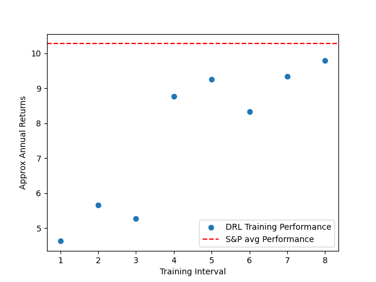
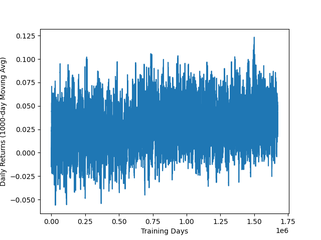
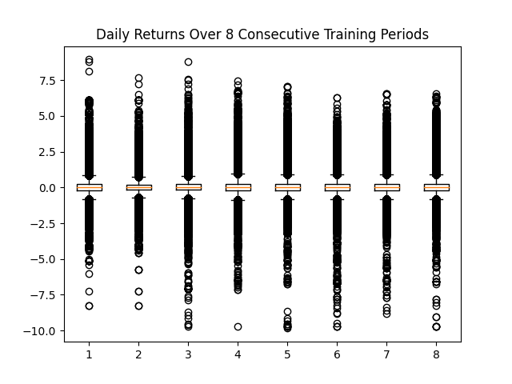
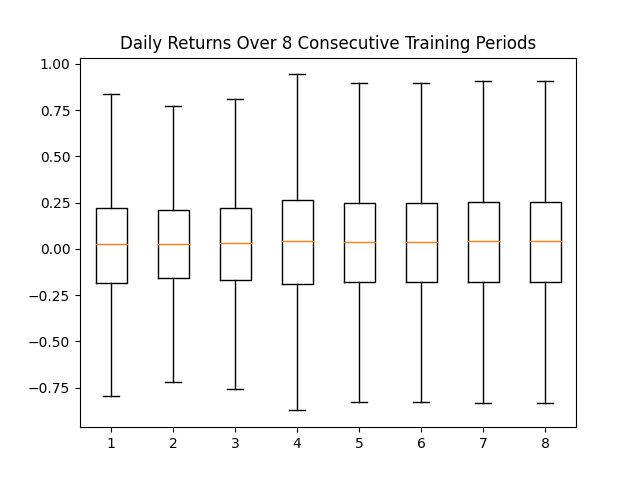

# Fail Fast

I was interested in the concept of employing DRL for day trading. I expected 
the signal to noise ratio would be too poor but I was eager to get some 
experimental evidence. I decided to focus on making trading SPY and trading 
only every 15 minutes to cut down on the noise. 

I wanted to devise a quick experiment to see if there was any potential here. 
This was mostly just for fun.

# Data 

I downloaded 10 years of SPY ticker data from polygon's REST API: 
https://polygon.io/ .

Each tick contains open, high, low, close, and the volume.

# Environment specs

The doc string for the TradeEnv constructor gives a good summary of the 
environment:

```
Constructor for TrandEnv instance. Sets the discrete action space size.
The size is two. There are two trade modes, pre-entry and pre-exit.
In the pre-entry mode 0 = do nothing and 1 = buy. In the pre-exit mode
0 = hold and 1 = sell.

The size of the observation space is 7*num_ticks. It contains the following information:
{trade mode : 0 for pre-entry, 1 for pre-exit;
high, low, open, close, volume weighted, volume, and time data for each tick,
purchase price if in pre-exit mode (otherwise -1)}

Note all price data is normalized to the previous day's close.

Note times are normalized so that 930am = 0 and 4pm = 1.

The reward is the log appreciation if holding and zero otherwise:
    = log( current close price / purchase price )
```

Note we have a very simple action space here where we are either all in or all 
out. While this is unrealistic it makes it easier to fail fast and see if there
is any merit here. Furthermore, note we are not taking into account fees or 
slippage. 

Notice the log price appreciation reward function. This enables us to add the 
geometric appreciation through addition and provides a dense reward signal.

Also, note that we use we use -1 to fill in NA information such as purchase 
price if it is not available. 

# Experiment

I trained with rllib's PPO model using two 15-minute ticks in the state. Prices
are normalized to the previous day's close and time is normalized so that 930am
is zero and 430pm is 1.0.

We use 8 years of daily SPY data in its entirety for training. Note that a 
proper train-test split was not performed here so we cannot expect the model
to generalize. I wanted to see if the algorithm was capable of outperforming
the market when given the chance to overfit. 

# Results

The data was far too noisey for the typical moving average indicator (see 
Difficulty of Visualization section). 
There are roughly 1.6 million daily appreciation data points. What I did was
split the data into 8 sequential sections of training time which are about 
200k points each. The data is still ridiculously noisey but we can see some trends.



Above is the approximated geometric average performance for each of the 8 
sections. These are plotted above and compared with the S&P 500's average
geometric appreciation over the same time period of the data. As you can see
the DRL agend does learn to make significant progress in performance. Jumping
from just 4.63% expected profit to 9.79% at the end which is near, but does not
surpass the S&P average for period which is 10.27%.


|  Training Section | Mean Daily Appreciation | Approx Geometric Annual Appreciation | Std Daily Appreciation| 
|         ---       | ---  |      ---          | --- |
| 1 | 0.0180% | 4.63% | 0.514% | 
| 2 | 0.0218% | 5.66% | 0.489% | 
| 3 | 0.0204% | 5.28% | 0.514% | 
| 4 | 0.0334% | 8.77% | 0.521% | 
| 5 | 0.0351% | 9.25% | 0.507% | 
| 6 | 0.0318% | 8.33% | 0.498% | 
| 7 | 0.0354% | 9.34% | 0.500% | 
| 8 | 0.0371% | 9.79% | 0.507% | 

While the mean performance does seem to increase over training time, the std
does not decrease. This is concerning since the std is an order of magnitude
higher than the expected return.

# Difficulty of Visualization

At first I naively attempted to create a moving average of mean daily returns.



The above figure has mean daily returns on the y and training steps on the x 
axis. A lag of 1000 steps is used As you can see, even with a lag of 1000 
results were all over the place. Instead I opted to break the training data
into 8 consecutive sections and examine the box plots.



Above you see the box plots of the daily returns over the 8 consecutive
training sections. As you can see the plot is filled with outliers so you can't
see any clear trends. Outliers here are defined using matplotlib's default, 
points that exceed 1.5*IQR where IQR = Q3 - Q1. Consequently, I tried plotting
without the outliers below.



As you can see this gives us a clearer pictures and more reasonable range for
daily returns. However, the range is very large compared to observable 
midpoints and it's hard to see a clear trend. Therefore, I decided to just plot
the mean performance and pair the plots with a table which shows the returns
and standard deviation. 

# Analysis of Agent Behavior

TODO: I want to develop a script to step through episodes and highlight where
the algorithm buys and sells on a candle stick plot. Would be interested to 
see if there are any apparent trends.


# Conclusion

Average results are on par with the S&P average over the same period of time.
Due to this fact and the various drawbacks of this method: slippage, fees, 
taxes, potential overfitting, extreme variance, etc just investing in the S&P
seems like a much more promising bet.

This is not to say that there isn't some different application of DRL to
day trading or investing that can outperform the market or that we couldn't
have improved performance by simply training longer. But the lack of market
beating performance given exceptionally generous assumptions makes me want to
pursue alternative approaches. 

